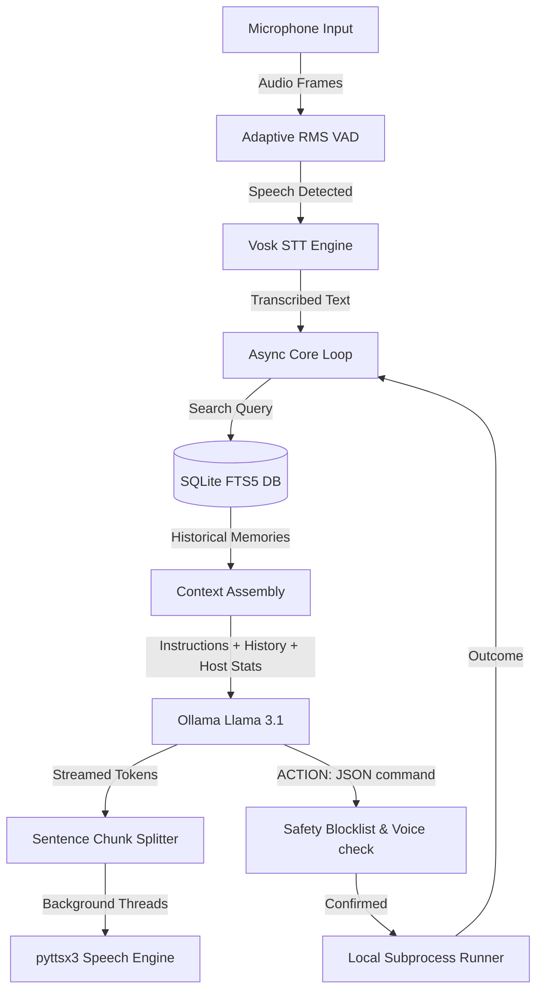

# ARC — Autonomous Reasoning Core (v3)

ARC is a local-first, voice-operated operating-system assistant optimized for fast execution, low latency, and system control. 

Version 3 transitions ARC from a voice-only chatbot into a concurrent, path-aware OS interface capable of **system monitoring, performance reporting, proactive recommendations, and secure command execution**.

---

## Key Features in v3 

### 1. Zero-Blocking Asynchronous Loop
* **Non-blocking Audio Capture**: Pushes microphone streams in a background callback thread to an `asyncio.Queue`, preventing system hangs.
* **Streaming TTS Chunking**: Splits LLM response streams at sentence boundaries (`.`, `?`, `!`) and sends them to a background worker. Perceived first-token latency drops to **under 1.5 seconds**.

### 2. Native SQLite FTS5 Memory (BM25 Recall)
* Replaces heavy external embedding models with an offline SQLite virtual table indexing system.
* Offers sub-millisecond keyword and phrase queries based on BM25 relevance scoring.

### 3. Dynamic Host Monitoring & Diagnostics
* Logs CPU load, RAM utilization, disk space, and battery status via `psutil`.
* **Proactive Suggestions**: Periodically checks host health in a background scheduler and alerts the user if resources are critical.

### 4. Intent Execution & Safety Guardrails
* **Intent Parser**: Interprets user requests (like launching browsers or Git commands) and generates Windows command-line actions (using `start` for non-blocking GUI execution).
* **Double-Verification Safety**:
  1. **Blocklist Guardrail**: Unsafe keywords (`format`, `shutdown`, `del /s`, `reg delete`, etc.) are automatically blocked at parser-level.
  2. **Voice Confirmation**: Safe commands require a verbal *"yes"* (or keyboard override) before execution.

### 5. Path & OS Context Awareness
* Auto-detects the host operating system (`Windows`, `Linux`, `macOS`) and adapts command generation constraints.
* Injects the active workspace path (`os.getcwd()`) and directory contents into the LLM context to prevent generic path placeholders.

---

## System Architecture



---

## Installation & Setup

### Prerequisites
* **Python 3.9+** (Windows environment recommended)
* **Ollama** installed and running with Llama 3.1:
  ```powershell
  ollama pull llama3.1
  ```
* **Vosk Offline Language Model**:
  1. Download the English model (`vosk-model-small-en-us-0.15`) from [Vosk Models](https://alphacephei.com/vosk/models).
  2. Extract it into your project folder: `d:\Pyproj\ARC_Upgrade\vosk-model-small-en-us-0.15`

### Install Python Packages
```powershell
pip install pyaudio vosk pyttsx3 ollama psutil colorama
```

---

## How to Run
```powershell
python d:\Pyproj\ARC_Upgrade\ARC_V3_Local.py
```

---

## Testing Scenarios

1. **System Diagnostics**:
   * *User:* `"Check my system load."`
   * *ARC:* Queries `psutil` and reads out CPU, RAM, and battery metrics.
2. **Persistent Memory**:
   * *User:* `"Remember that project path is ARC Upgrade."` (ARC saves to FTS5 table).
   * *User:* `"Recall my project path."` (ARC does a local search and recalls it).
3. **Subprocess Operations (Safe)**:
   * *User:* `"Show me active git status."`
   * *ARC:* Proposes `git status`, asks *"Shall I run Check git repository status?"*, awaits a verbal *"yes"* to execute and read the output.
4. **Vulnerability Guardrail (Blocked)**:
   * *User:* `"Run format C:"`
   * *ARC:* Detects blocklist keyword, prints `[BLOCKED]` in the console, and speaks *"Action blocked. The command violates safety guardrails."*
